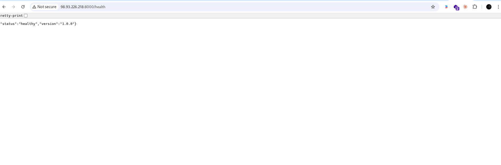

# AWS Deployment Report

## 📌 Overview
This project was successfully deployed on AWS EC2.  
Below are the steps and screenshots confirming the deployment.

---

## 🚀 EC2 Instance

- Instance is created and running
- Public IP is assigned



---

## 🔐 SSH Connection

Successfully connected to the EC2 instance using SSH.

```bash
ssh -i <your-key>.pem ec2-user@<your-public-ip>
